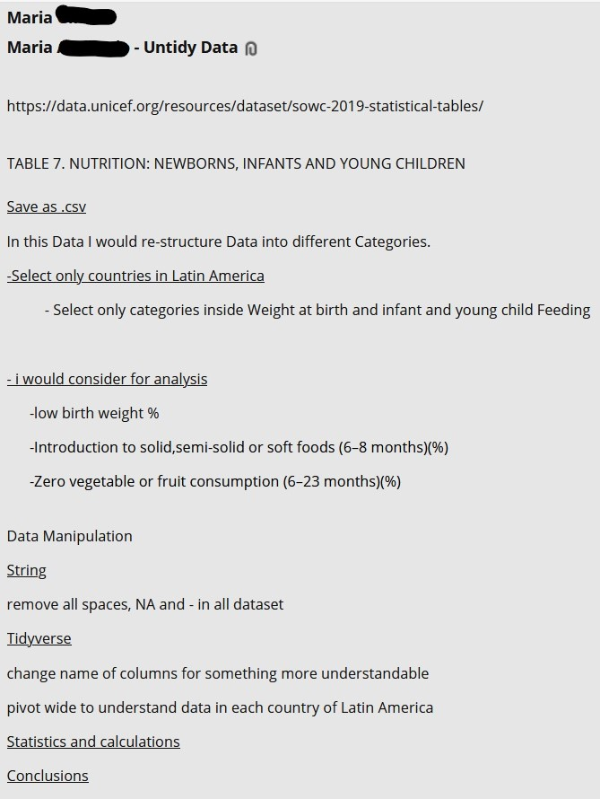

```{r, echo=FALSE,warning=FALSE, results='hide', include=FALSE}
library(tidyverse)
library(dplyr)
library(reactable)
library(kableExtra)
library(stringr)
```

<!-- (https://rdrr.io/cran/reactable/man/reactable.html) -->

# UNICEF Dataset{.tabset .tabset-pills}


## Assignment Requirements


The goal of this assignment is to give you practice in preparing different datasets for downstream
analysis work.
**Your task is to:**

1. Choose any three of the “wide” datasets identified in the Week 6 Discussion items. 
**(You may use your own dataset; please don’t use my Sample Post dataset, since that was used in your Week 5 assignment!)**
    * For each of the three chosen datasets:
      + Create a .CSV file (or optionally, a MySQL database!) that includes all of the information included in the dataset. 
      + *You’re encouraged to use a “wide” structure similar to how the information appears in the discussion item, so that you can practice tidying and transformations as described below.*
      + Read the information from your .CSV file into R, and use `tidyr` and `dplyr` as needed to tidy and transform your data. [Most of your grade will be based on this step!]
      + Perform the analysis requested in the 
      **discussion item.**[^1]
      
      + Your code should be in an R Markdown file, posted to [rpubs.com](https://rpubs.com/] web page), and should include narrative descriptions of your data cleanup work, analysis, and conclusions.
      
      [^1]::{width=50%}
      
2. Please include in your homework submission, for each of the three chosen datasets:
    + The URL to the .Rmd file in your GitHub repository, and
    + The URL for your [rpubs.com](https://rpubs.com/] web page)

## Child Mortality

### Import Data

Data is imported from the .csv's `Child Mortality.csv` from my [github Project 2 folder](https://github.com/gcampos100/DATA607Spring2021/tree/main/Projects/Project%202) using the function `read_csv` from the `readr` package.

```{r, include=FALSE}
# path to csv's
csv_Child_Mortality= 
"https://raw.githubusercontent.com/gcampos100/DATA607Spring2021/main/Projects/Project%202/Child%20Mortality.csv"
```


```{r, results='hide', message=FALSE}
df_Child_Mortality <- read_csv(csv_Child_Mortality,
                                 col_names = FALSE,
                                 na = c("NA","?"),
                                 skip = 5,
                                 n_max = 222,
                                 locale = readr::locale(encoding = "latin1"))
```
Rows Range [^2]     `NA's` [^3]       Unicode-8[^4]

[^2]:Notes from the bottom of the .csv were excluded. Main data was selected between rows 5 to 222.:
[^3]:`NA` and `?` were deliberately set to NA:
[^4]:encoding set to *latin1* to account for accents, in country naming convention:

**The Headers were not workable as a direct import from the csv, due to several columns having multi-headers as shown below**


<body>
  <div class="container">
  <br>
</div>

```{r, echo=FALSE}
colnames_Child_Mortality <- c("Countries and areas",
          "Under-5 mortality rate (deaths per 1,000 live births) 1990",
          "Under-5 mortality rate (deaths per 1,000 live births) 2000",
          "Under-5 mortality rate (deaths per 1,000 live births) 2018",
          "Annual rate of reduction in under-5 mortality rate (%)",
          "Under-5 mortality rate by sex (deaths per 1,000 live births) 2018 (male)",
          "Under-5 mortality rate by sex (deaths per 1,000 live births) 2018 (female)",
          "Infant mortality rate (deaths per 1,000 live births) 1990",
          "Infant mortality rate (deaths per 1,000 live births) 2018",
          "Neonatal mortality rate (deaths per 1,000 live births) 1990",
          "Neonatal mortality rate (deaths per 1,000 live births) 2000",
          "Neonatal mortality rate (deaths per 1,000 live births) 2018",
          "Probability of dying among children aged 5–14 (deaths per 1,000 children aged 5) 1990",
          "Probability of dying among children aged 5–14 (deaths per 1,000 children aged 5) 2018",
          "Annual number of under-5 deaths (thousands) 2018",
          "Annual number of neonatal deaths (thousands) 2018",
          "Neonatal deaths as proportion of all under-5 deaths (%)",
          "Number of deaths among children aged 5–14 (thousands)2018")
```

Names were stored to the variable `colname_Child_Mortality` and applied to the data frame.\newline
Columns comprised entirely of `NA` values, are removed as well.

```{r}
df_Child_Mortality <- 
  df_Child_Mortality %>% select (everything(), -matches("[3579]$"),-matches("[123][13579]$"))
```

```{r}
colnames(df_Child_Mortality)<- colnames_Child_Mortality
```

```{r, echo=FALSE}
kbl(sapply(df_Child_Mortality, class),col.names = "",caption = "Column Names and Type") %>%
  kable_styling(bootstrap_options = "striped",position = "float_right", full_width = F)
```

<body>
  <div class="container">
  <br>
  <br>
  <br>
  <br>
  <br>
  <br>
  <br>
  <br>
  Manual column names were used in place of the **.csv multi-headers**. Names are basically a concatenation of the *Main Header* and *Sub Headers* whenever applicable.
  </div>

### Manipulating Imported Data

The existing data frame `df_Child_Mortality` is a strong representation of the data stored, **as is**, on the *.csv*. Many values in the data set are specified in the header as **(deaths per 1,000 lives births)** however.

```{r, echo=FALSE}
reactable(df_Child_Mortality %>%
            select(matches("\\(deaths per 1,000 live births|\\(deaths per 1,000 children aged 5\\)")),
          bordered = TRUE,
          striped = TRUE,
          highlight = TRUE,
          filterable = FALSE,
          showPageSizeOptions = TRUE,
          showPagination = TRUE,
          pageSizeOptions = c(5, 15,25,50,75, 100), defaultPageSize = 5)
```

In order to simplify the values and names accordingly, I divide the values in those columns by 1000 and remove the comments from each column name.

```{r, message=FALSE, results='hide', warning=FALSE}
#copy integer valued table to address formatting issues with kableExtra:: and reactable::
df_int_Child_Mortality<- 
  df_Child_Mortality
#located index of 1,000 columns for formatting with kableExtra:: and reactable::
column_1000_index<-
  grep("1,000 ",colnames(df_int_Child_Mortality))
#Divide values by 1000
df_Child_Mortality<-
  df_Child_Mortality %>%
  mutate_at( vars( matches("\\(deaths per 1,000 live births)")) ,funs(./1000))

```

```{r, echo=FALSE}
#rename columns
colnames(df_int_Child_Mortality)<-
  str_replace_all(colnames(df_int_Child_Mortality),
    pattern = "\\(deaths per 1,000 live births\\)|\\(deaths per 1,000 children aged 5\\)",
                          replacement = "")
```


```{r}
#rename columns
colnames(df_Child_Mortality)<-
  str_replace_all(colnames(df_Child_Mortality),
    pattern = "\\(deaths per 1,000 live births\\)|\\(deaths per 1,000 children aged 5\\)",
                           replacement = "")
```

```{r, echo=FALSE, include=FALSE}
## This serves as a point of reference for converting decimals to reactable
reactable(df_int_Child_Mortality %>%
          select(c(column_1000_index))%>%
            mutate_all( funs(./1000)),
          bordered = TRUE,
          striped = TRUE,
          highlight = TRUE,
          filterable = FALSE,
          showPageSizeOptions = TRUE,
          showPagination = TRUE,
          pageSizeOptions = c(2,4,6,8,10), defaultPageSize = 5)
            
```

```{r, echo=TRUE}
#change type back to numeric after renaming columns converted it into `num`
df_Child_Mortality[] <- 
  lapply(df_Child_Mortality, function(x) {
    if(is.factor(x)) round(as.numeric(as.character(x)),3) else x
})
```

```{r, echo = FALSE}
head(df_int_Child_Mortality, n = 5) %>%
          select(c(column_1000_index))%>%
            mutate_all( funs(./1000)) %>%
              kbl()
```

```{r, include=FALSE}
sapply(df_Child_Mortality, class)
```

<br>
The values inside the columns with `%` and `(thousands)` indicators will also be modified to reflect the exact numeric value.

```{r, echo=FALSE}
#located index of 1,000 columns for formatting with kableExtra:: and reactable::
column_index_thousand_index<-
  grep("\\%|thousands",colnames(df_int_Child_Mortality))
column_percent_index<-
  grep("\\%",colnames(df_int_Child_Mortality))
column_thousand_index<-
  grep("thousands",colnames(df_int_Child_Mortality))
```


```{r, echo=FALSE,message=FALSE, warning=FALSE, results='hold', out.width="75%"}
head(df_int_Child_Mortality, n = 4) %>%
          select(c(column_index_thousand_index))%>%
              kbl()%>%
                kable_styling(bootstrap_options = "striped", full_width = F)
```

<body>
  <div class="container">
  </div>


Note[^5]

[^5]:Columns with a `%` indicator will be divided by 100 and `(thousands)` multiplied by 1000 accordingly:


```{r, message=FALSE, results='hide', warning=FALSE}
#Divides % column values by 100
df_Child_Mortality<-
  df_Child_Mortality %>%
  mutate_at( vars( matches("\\%")) ,funs(./100))

#Multiplies "(thousands)" column values by 1000
df_Child_Mortality<-
  df_Child_Mortality %>%
  mutate_at( vars( matches("thousands")) ,funs(.*1000))
```


```{r}
#rename columns
colnames(df_Child_Mortality)<-
  stringr::str_replace_all(colnames(df_Child_Mortality),
                           "\\(\\%\\)|\\(thousands\\)",
                           "")
```

<br>
The final table before calculating for analysis is below.

```{r, echo=FALSE}
reactable(df_Child_Mortality,
          bordered = TRUE,
          striped = TRUE,
          highlight = TRUE,
          filterable = TRUE,
          showPageSizeOptions = TRUE,
          showPagination = TRUE,
          pageSizeOptions = c(5, 15,25,50,75, 100), defaultPageSize = 10)
```
