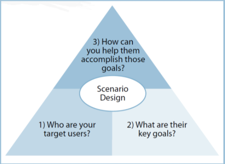

```{r global_options, include=FALSE}
knitr::opts_chunk$set(eval = TRUE, results = "hold")

```

# Assignment {.tabset}

## Overview


[Building the Next New York Times Recommendation Engine - The New York Times.pdf](https://bbhosted.cuny.edu/bbcswebdav/pid-2729570-dt-forum-rid-425095280_1/xid-425095280_1)

[Amazon-Recommendations Item to Item Collaborative Filtering .pdf](https://bbhosted.cuny.edu/bbcswebdav/pid-2729570-dt-forum-rid-425095281_1/xid-425095281_1)

Your task is to analyze an existing recommender system that you find interesting.  You should:

1. Perform a Scenario Design analysis as described below.  Consider whether it makes sense for your selected recommender system to perform scenario design twice, once for the organization (e.g. Amazon.com) and once for the organization's customers.
2. Attempt to reverse engineer what you can about the site, from the site interface and any available information that you can find on the Internet or elsewhere.
3. Include specific recommendations about how to improve the site's recommendation capabilities going forward. 
4. Create your report using an R Markdown file, and create a discussion thread with a link to the GitHub repo where your Markdown file notebook resides.  You are not expected to need to write code for this discussion assignment.

## Examples

Here are two examples of the kinds of papers that might be helpful backgrounders for your research in #2 above (if you had chosen amazon.com or nytimes.com as your web site):

* Greg Linden, Brent Smith, and Jeremy York (2003): [Amazon.com Recommendations:  Item-to-Item Collaborative Filtering](https://datajobs.com/data-science-repo/Recommender-Systems-[Amazon].pdf),  IEEE Internet Computing. 
* Alex Spangher (2015): [Building the Next New York Times Recommendation Engine](http://open.blogs.nytimes.com/2015/08/11/building-the-next-new-york-times-recommendation-engine/)

## <span style="color:blue">How to Perform a Scenario Analysis (review)</span>.

Scenario Design is an easy-to-use “three question framework” that helps you in making sure that the information in your analysis work takes UX (user experience) into account:



Source: “Scenario Design:  A Disciplined Approach to Customer Experience,” Bruce D. Temkin, Forrester Research, 2004.  Temkin notes that before applying Scenario Design, one might ask, “What functionality should we offer?”  After applying Scenario Design, one might instead ask, “What user goals should we serve?”

## Task

Your task is to:

1. Identify a recommender system web site, then
2. Answer the three scenario design questions for this web site.

This process of guessing/reverse engineering, while inexact, will help you build out your own ability to better account for “user needs” in designing recommender systems going forward.  Being able to place the customer first in your mind is a “soft skill” that is highly valued in the technical marketplace.

*You may work in a small group on this discussion assignment!  Please make your initial post (which includes a link to your GitHub hosted R Markdown file before our meetup on Wednesday, and provide feedback to at least one of your class mates’ posts before end of day on Sunday.  Your feedback should include at least one additional reference and/or constructive suggestion.*

# GrubHub {.tabset}

{width="25%"}

## Scenario Design

**3 Question Framework**

1. 
