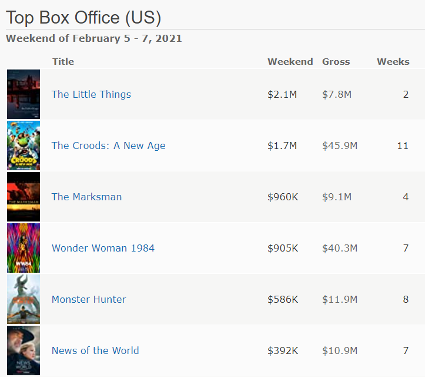

```{r, echo=FALSE,warning=FALSE,message=FALSE}
library(RMySQL)
library(DBI)
library(odbc)
library(kableExtra)
library(knitr)
library(xtable)
library(tidyverse)
```


Assignment Requirements
=======================
**DATA607 Week 2 assignment:** 

1. Choose six recent popular movies. Ask at least five people that you know *(friends, family, classmates, imaginary* *friends if necessary)* to rate each of these movies that they have seen on a scale of **1** to **5**. 
2. Take the results *(observations)* and store them in a SQL database of your choosing. Load the information
from the **SQL database** into an **R dataframe**.
3. *This assignment does NOT need to be 100% reproducible.* You can **(and should) blank out your SQL password** if
your solution requires it; *otherwise, full credit requires that your code is “reproducible,” with the assumption*
*that I have the same database server and R software.*
4. *Handling missing data is a foundational skill when working with SQL or R*. To receive full credit, you should
demonstrate a **reasonable approach for handling missing data.** After all, how likely is it that all five of your
friends have seen all six movies?
5. You’re encouraged to **optionally** find other ways to make your solution better. For example, consider
incorporating one or more of the following suggestions into your solution:
    + Use survey software to gather the information.
    + Are you able to use a password without having to share the password with people who are viewing your code?         There are a lot of interesting approaches that you can uncover with a little bit of research.
    + While it’s acceptable to create a single SQL table, can you create a normalized set of tables that  corresponds     to the relationship between your movie viewing friends and the movies being rated?
    + Is there any benefit in standardizing ratings? How might you approach this?

*You may work in a small group on this assignment. If you work in a group, each group member should indicate*
*who they worked with, and all group members should individually submit their week 2 assignment.*

**(Optional) Reading related to this assignment:**

* **[James Le, “The 4 Recommendation Engines That Can Predict Your Movie Tastes”, May 1, 2018.](https://towardsdatascience.com/the-4-recommendation-engines-that-can-predict-your-movie-tastes-109dc4e10c52)** This a nice backgrounder on movie recommendation engines. We’ll learn more about recommender systems later in the course.
* **[Steve Blank, “The Customer Development Process. 2 Minutes to See Why”, Jul 29, 2014.](https://www.youtube.com/watch?v=xr2zFXblSRM&t=27s)** In this [<3 minute] YouTube video *“lean startup”* founder Steve Blank talks about the importance of getting out of the building to talk to customers. I’d encourage you to adopt this *“builder mentality”* in your own data science work whenever it’s practical, by collecting data yourself, whether it’s related to a *“business experiment”* or a “scientific experiment.”

Overview
========

**[IMDB](https://www.imdb.com)** has a chart for there **["Top Box Office (US)](https://www.imdb.com/chart/boxoffice)"** movies. The rankings for the weekend of February 5-7, 2021 were as follows:\newline


{width=40%}\newline


The created survey reflected ratings for the movies noted on IMDB.

Data Dictionary
---------------
The following lists the variables related to the .csv files and databases created using the SQL scripts on **[github.com/gcampos100/.CSV & SQL files](https://github.com/gcampos100/DATA607Spring2021/blob/main/Week%202/DATA607%20Week%202%20Assignment%20SQL%20Script_Mod.sql)** :


```{r, echo=FALSE}
movieRating_d_dict_desc <- data.frame (
                  "Attributes" = c("SurveyID", "MovieID","Rating","Details"),
                  "Description" = c("Unique ID of Survey taken", 
                                    "Unique ID of Movie (Foreign key to movieName Database)",
                                    "Rating from 1-5","Definition of Rating as per survey descriptions")
                  )
movieName_d_dict_desc <- data.frame (
                  "Attributes" = c("MovieID","Name"),
                  "Description" = c("Unique ID of Movie (Primary key to movieName Database)",
                                    "Movie Name")
                  )
```

```{r, echo=FALSE}
kbl(movieRating_d_dict_desc,booktabs = T, caption = "movieRating Database") %>%
  kable_styling()

kbl(movieName_d_dict_desc,booktabs = T, caption = "movieName Database") %>%
  kable_styling()
```


Load Data
=========

Data Set Title: 6 Recent Popular movies
---------------------------------------

### Source Information:

(a) Creator: Gabriel Campos
(b) Personal Survey: **[surveymonkey.com](https://www.surveymonkey.com/r/R65336R)** \newline
**NOTE:** *To avoid $25 monthly subscription with SurveyMonkey, I created .csv for my long-time* \newline
*imaginary friends' survey results, to simulate what I imagine the data export would look like.*
(c) Github: **[github.com/gcampos100/ .CSV & SQL files](https://github.com/gcampos100/DATA607Spring2021/tree/main/Week%202)**
\clearpage

### Connecting

Connection is established using the Open Database Connectivity [(ODBC)](https://docs.microsoft.com/en-us/sql/odbc/reference/what-is-odbc) configured on my local machine to connect to MySQL with a user that has **[read privileges](https://www.techbeamers.com/mysql-grant-privileges/)** on my specified table. The `askForPassword` function prompts the user to specify the DSN via a GUI. In this way the DSN name and connection string are both masked, while the database directly is protected via the `Principle of Least Privilege`.

```{r}
DSN <- rstudioapi::askForPassword("DSN Name")
```


```{r,include=TRUE}
con <- dbConnect(odbc(),DSN)
```

```{r, echo = FALSE}
paste0("Tables available on this db are ")
dbListTables(con)
```

### Importing the Data
Using the **[dbGetQuery() function](https://www.rdocumentation.org/packages/DBI/versions/0.5-1/topics/dbGetQuery)** which is a part of the **[DBI package](https://db.rstudio.com/dbi/)** I was able to run a SQL query directly and import the results onto a dataframe for further use. \newline

**NOTE:** *Importing of NULL values in database, converts to NA in the dataframe.*

```{r}
movieRatingsQuery <- dbGetQuery(con,
                        "SELECT surveyID,name AS movie, rating, details
                        FROM movieRatings
                        JOIN movieName ON movieRatings.movieID = movieName.movieID;")
```

NULL Values
============

## Count

A count of the amount of NULL values can be done directly from the database using an SQL query or the obtained by subsetting the loaded data frame as show below. \newline 
**NOTE:** *Once again, NULL values are converted to NA using the dataframe, but will display as NULL when using dbGetQuery with not importing*

```{r, echo = FALSE, results=FALSE}
missing_data1<-dbGetQuery(con,
                              "SELECT surveyID,name AS movie, rating, details
                              FROM movieRatings
                              JOIN movieName ON movieRatings.movieID = movieName.movieID
                              WHERE rating IS NULL;")

```

```{r, echo = FALSE, results=FALSE}
rownames(missing_data1) <-NULL
nrow(missing_data1)
missing_data1<-missing_data1 %>%
  kbl() %>%
  kable_paper("hover", full_width = F)
```


```{r, echo = TRUE, results=FALSE}
dbGetQuery(con,
           "SELECT surveyID,name AS movie, rating, details
                              FROM movieRatings
                              JOIN movieName ON movieRatings.movieID = movieName.movieID
                              WHERE rating IS NULL;")
```

```{r, echo=FALSE, results=FALSE}
missing_data2<-subset(movieRatingsQuery,is.na(movieRatingsQuery$rating))
rownames(missing_data2) <-NULL
nrow(missing_data2)
missing_data2<-missing_data2 %>%
 kbl() %>%
 kable_minimal("hover", full_width = F)%>%
footnote(general ="The count for observations on both methods is 10, indicating no data loss for either method")
```

```{r, echo=TRUE, results = FALSE}
subset(movieRatingsQuery,is.na(movieRatingsQuery$rating))
```

```{r, echo=FALSE,fig.width=.1}
missing_data2
```

### Modify data

The loaded data frame `movieRatings` obtained with a join query of `movieRating` and `movieName` databases, accounts for all data include 10 NULL values. In order to aggregate this, we again can chose to eliminate the NULL values from the SQL query used to import or from the already loaded data frame as shown below

```{r, results=FALSE}
dbGetQuery(con,
             "SELECT name AS movie, rating, details, count(rating)
              FROM movieRatings
              JOIN movieName ON movieRatings.movieID = movieName.movieID
              where rating IS NOT NULL 
              group by movie, rating, details 
              ORDER by movie ASC, rating DESC;"
            )
```

```{r, results=FALSE}
subset(movieRatingsQuery,!is.na(movieRatingsQuery$rating))
```

```{r, echo=FALSE, results=FALSE}

movieRatingGroupQ<-dbGetQuery(con,
                              "SELECT name AS movie, rating, details, count(rating)
                              FROM movieRatings
                              JOIN movieName ON movieRatings.movieID = movieName.movieID
                              where rating IS NOT NULL 
                              group by movie, rating, details 
                              ORDER by movie ASC, rating DESC;"
)
nrow(movieRatingGroupQ)
sum(movieRatingGroupQ$`count(rating)`)
```

```{r, echo=FALSE, results=FALSE}
movieRatingsSubset <- subset(movieRatingsQuery,!is.na(movieRatingsQuery$rating))
nrow(movieRatingsSubset)
rownames(movieRatingsSubset)<-NULL
```

```{r , echo=FALSE, results=TRUE,out.height="30%"}
movieRatingGroupQ %>%
  kbl() %>%
  row_spec(seq(1,nrow(movieRatingGroupQ),2), background="#d2f8d2 ") %>% 
   kable_styling(bootstrap_options =c("striped","condensed"),full_width=FALSE)%>%
      footnote(symbol = "The Total sum of our count is 26, accounting for 26 total observations")
```

```{r, echo=FALSE, results=TRUE,out.height="30%"}
movieRatingsSubset %>%
 kbl() %>%
  kable_styling(bootstrap_options =c("bordered","responsive"),full_width=FALSE)
```


Conclusions
===========

```{r, echo=FALSE, results=FALSE,warning=FALSE}
movie_avg<-movieRatingsSubset %>%
   group_by(movie) %>%
   summarise(MeanRating=(mean(rating)))
```

```{r message = FALSE, echo=FALSE,warning=FALSE}
movieRatingsSubset %>%
   group_by(movie) %>%
   summarise(MeanRating=(mean(rating)))
```


```{r, echo=FALSE,warning=FALSE}
ggplot(data=movie_avg, aes(x=movie_avg$movie, y=movie_avg$MeanRating)) +
    geom_bar(aes(fill=movie_avg$movie),colour="black",stat="identity")+
    guides(fill=FALSE)+
    xlab("MOVIE RATING") + ylab("MOVIE TITLE")+
    ggtitle("AVERAGE RATING OF MOVIES")
```


  Deciding on how to import the data can greatly affect what visuals are used to represent them. Using the charts with dbQuery() function can help with small sets like this, when few options are present. I could have concluded that `Little Things` was most liked in that format and even if hundreds of surveys were to come in, I feel the chart is sufficient to digest and draw conclusions. Importing fully into a data frame however, allows for more manipulation, allowing me to suggest with full confidence `Little Things` as it's average rating is well above the rest.